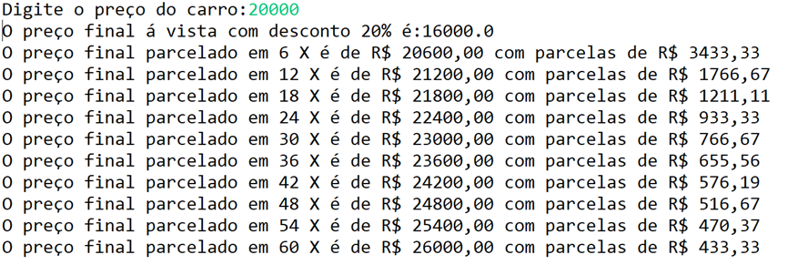
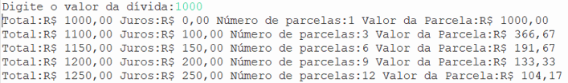

# Lista de exercícios com Ifs

Fintech, abreviação de financial technology, refere-se, principalmente, às startups que desenvolvem produtos financeiros totalmente digitais, através da utilização intensiva da tecnologia. Aliás, este é o principal diferencial das Fintechs em relação às instituições tradicionais do setor financeiro: por meio da tecnologia, disponibilizar aos seus clientes os principais produtos do setor financeiro de maneira simples.

Neste contexto, desenvolva soluções em Python para atender às seguintes necessidades de negócio:

## Exercício 1

A Bidu é uma startup na área de Fintech fundada em 2011 que ajuda os usuários a controlar suas fontes de receitas, gastos, dívidas e investimentos. Ela precisa realizar uma votação para escolher qual dia da semana é o melhor para a realização das lives com o time da mentoria financeira. Desenvolva um programa em que os colaboradores informem um dos 5 dias da semana (segunda-feira, terça-feira, quarta-feira, quinta-feira e sexta-feira) da sua preferência para participar da live. Verifique e exiba ao final, qual dia foi o escolhido pelos colaboradores.

**Observação:** Verifique o número de colaboradores que irão participar da votação para programar sua estrutura de repetição

##

## Exercício 2

A compra de um veículo pode ser realizada parcelada. Crie um programa que receba o valor de um carro e mostre **uma tabela** com os seguintes dados: preço final, quantidade de parcelas e valor da parcela. Considere o seguinte:

a) O preço final para compras à vista tem um desconto de 20%;

b) A quantidade de parcelas pode ser: 6, 12, 18, 24, 30, 36, 42, 48, 54, 60.

Os percentuais de acréscimo seguem na tabela abaixo:

| Quantidade de parcelas | Percentual de Acréscimo sobre o preço final |
| :--------------------: | :-----------------------------------------: |
|           6            |                     3%                      |
|           12           |                     6%                      |
|           18           |                     9%                      |
|           24           |                     12%                     |
|           30           |                     15%                     |
|           36           |                     18%                     |
|           42           |                     21%                     |
|           48           |                     24%                     |
|           54           |                     27%                     |
|           60           |                     30%                     |

### Modelo de saída

**Observação:** Na saída do programa, utilize estrutura de repetição para representar a listagem, conforme o modelo acima.

##

## Exercício 3

Na oferta de um produto de crédito aos clientes, três informações são muito importantes apresentar ao cliente: valor da dívida, a taxa de juros e o número de parcelas para pagamento do empréstimo contraído junto à Fintech. Faça um programa que **receba o valor de uma dívida** e mostre **uma tabela** com os seguintes dados:

Os juros e a quantidade de parcelas seguem a tabela:

| Quantidade de parcelas | % de juros sobre o valor inicial da dívida |
| :--------------------: | :----------------------------------------: |
|           1            |                     0                      |
|           3            |                     10                     |
|           6            |                     15                     |
|           9            |                     20                     |
|           12           |                     25                     |

### Exemplo de saída do programa

**Observação:** Na saída do programa, utilize estrutura de repetição para apresentar listagem, conforme o modelo acima.

##

## Exercício 4

Toda vez que um cliente realiza um resgate de uma aplicação financeira, o sistema deve calcular a alíquota de imposto de renda (IR) que deve ser aplicada sobre aquele resgate, levando em consideração o número de dias que o valor permaneceu aplicado, de acordo com a tabela abaixo:

| Período de tempo  |  Alíquota   |
| :---------------: | :---------: |
| De 181 a 360 dias |  20% do IR  |
| De 361 a 720 dias | 17,5% de IR |
| Acima de 720 dias |  15% de IR  |

É o que acontece, por exemplo, com o CDB - Certificado de Depósito Bancário, uma aplicação de renda fixa comumente oferecida pelas Fintechs. Outros investimentos em renda fixa, como LCI e LCA, respectivamente, Letra de Crédito Imobiliário e Letra de Crédito do Agronegócio são isentos de imposto de renda. Escreva um programa que receba o tipo de investimento do qual se deseja realizar um resgate (1 para CDB, 2 para LCI e 3 para LCA), o valor a ser resgatado e o número de dias que esse valor permaneceu investido e, se for o caso, calcule o valor referente ao imposto de renda.

**Atenção!** O programa deve consintir se o investimento fornecido é válido, ou seja, 1, 2 ou 3.

##
